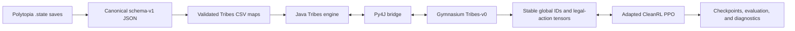

# Architecture

PolyVision is a research environment for training agents on a constrained economy-first task in *The Battle of Polytopia*. The implementation combines a Java game engine with Python RL tooling.

## Components

### Map pipeline

`tools/polytopia_state_converter` reads the generated initial state from compressed Polytopia saves and emits deterministic, schema-versioned JSON. `tools/polytopia_map_converter` maps supported Polytopia semantics to Tribes CSV tokens, validates geometry and contents, and can round-trip each result through the Java loader. The active training corpus is `pol_env/Tribes/levels/phase1_pool_bardur_real/`.

### Java engine

`pol_env/Tribes/src/` contains the Tribes game implementation. `core.game.PythonEnv` exposes reset, legal-action enumeration, step, observation, score, and rendering operations for Py4J. Compiled classes live in `pol_env/Tribes/out/`.

### Python bridge

`pol_env/Tribes/py/gym_env.py` starts a JVM with the compiled classes and `json.jar`, constructs `PythonEnv`, and translates JSON payloads into Python dictionaries. It exposes the engine's raw, state-local legal-action indices. It can also fast-path legal-action transfer and expose diagnostic full-visibility observations; those are not policy observations.

### Gymnasium environment

`pol_env/Tribes/py/register_env.py` registers `Tribes-v0` and implements the Phase 1 contract. It selects maps, runs the deterministic Bardur opening, flattens visible state, filters actions, maps raw Java actions to stable geometry-dependent global IDs, shapes rewards, and truncates after Bardur Turn 10.

The wrapper is intentionally stricter than the low-level bridge. It rejects mixed geometry, uncatalogued legal actions, global-ID collisions, overflow of the legal-slot tensor, and several action-selection inconsistencies.

### PPO

`py_rl/cleanrl/cleanrl/ppo.py` is the primary trainer. It retains CleanRL's single-file PPO structure while adding asynchronous multi-JVM environments, legality-aware actors, interface validation and caching, PolyVision metrics, checkpoint sidecar metadata, W&B integration, and profiling.

### Evaluation and diagnostics

`evaluate_brain.py` loads a compatible checkpoint for one-episode policy inspection. Current scripted baselines and targeted audits live in `py_rl/cleanrl/cleanrl/`; contract validation lives in `tools/validate_environment_contract.py`. Historical run evidence is kept separately under `docs/history/` and is not an assertion about the current interface.

## Control flow

On reset, the wrapper chooses a deterministic pool member, initializes Java, checks that its geometry matches the catalog, executes the fixed opening, and returns a flat observation plus legal-action tensors. On each step, PPO selects either a legal slot or a masked global ID, the wrapper maps that ID back to the exact current Java action, advances the engine, applies Phase 1 shaping, then constructs the next observation and legal interface.

See [Environment](environment.md) for episode semantics and [Reproducibility](reproducibility.md) for the identities that must be held constant across experiments.
